# Planning, tracking and analyzing actions

## Action Planning in Action Tracker <!-- DHIS2-EDIT:https://github.com/hisptz/unicef-apps-docs/edit/master/src/commonmark/en/content/action_tracker/at-app-action-planning.md -->

The action planning section allows you to record actions aimed at addressing the root causes of bottlenecks in the different determinants of health coverage. It provides a description of the actions required to address a specific problem, states the period within which this action should be done, responsible person, status of completion, review date and provides for any review notes.

### Action Planning

To access Action Planning option click on Action Planning tab
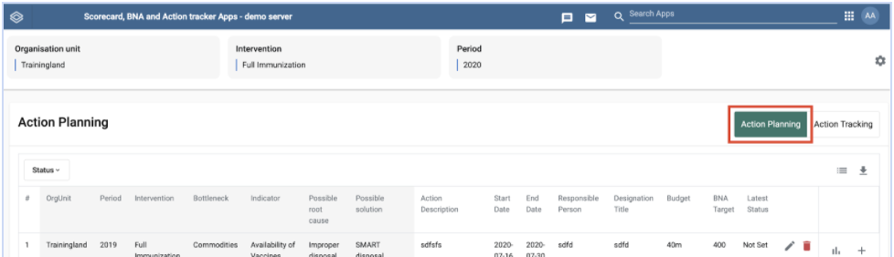{width=40%}

To access option for adding new action, right click on the intervention on Add Actions column

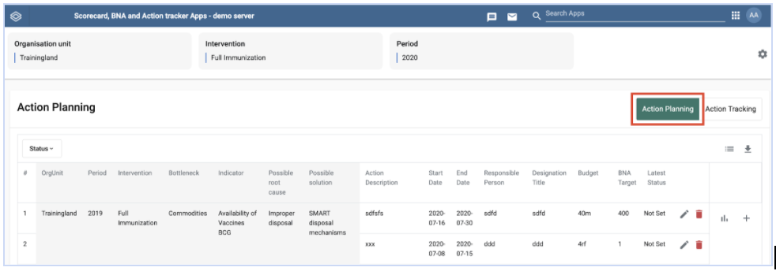{width=50%}

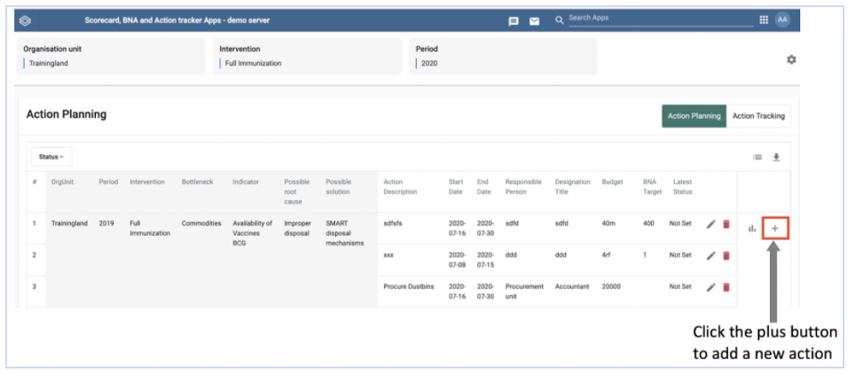{width=50%}

#### Action Description

This field (see Figure 2.1-C above) allows you to describe in detail the specific actions that will be taken to arrive at the proposed solution. The action recorded should be clear and specific. Only one action should be recorded and in case the proposed solution requires more than one, then another action is recorded as indicated in 2.1.B above.

#### Start Date and End Date

These fields  (see Figure 2.1-C above) are for the period over which it is anticipated that the action will be performed.

#### Responsible Person and Designation Title

These fields ((see Figure 2.1-C above) allow you to record the person who will be responsible for this action and their designation. This is important for follow up and progress of execution of the action.

#### Budget

This field allows you to record the amount of money that has been allocated to execute the action.

#### BNA Target

This field allows you to record the desired value to be attained by this indicator over a given period.  This should not be an arbitrary figure, however, it should be derived from approved program targets that were set by the respective program.

Once all the fields on  Figure 2.1-C above  have been filled, click on “update” to save the information in the action tracker.

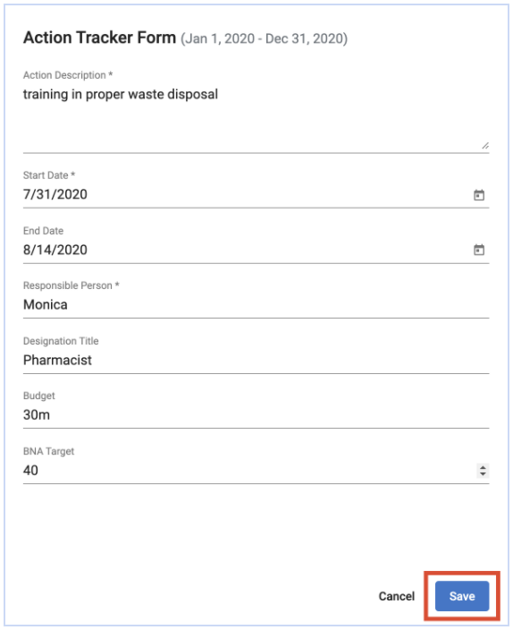{width=50%}

#### Adding Actions

In cases where the possible solution requires more than one action, additional actions can be added using the add button in the last column to the right (See Figure 2.1-B above). Click the 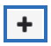{width=10%} icon to add more actions to the proposed solution. Once the fields are filled, save to continue.

### Edit or Delete a Field

To Edit or Delete an entry, right click on any cell for a given intervention and edit or delete an entry accordingly.

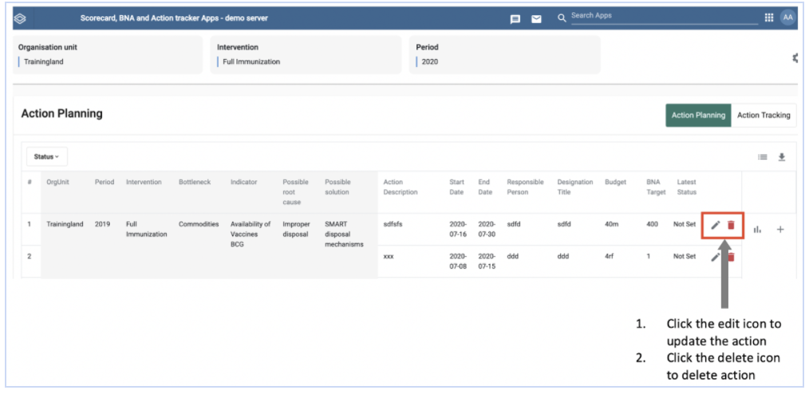{width=50%}

To edit the action, after clicking edit (Figure 2.1.2-A), update the data entry field where you want to make changes then click save (see Figure 2.1-D above)

To delete the action, after clicking the delete icon (Figure 2.1.2-A), click Yes if  you are sure  you want to delete action or click No if you don’t want to delete the action (Figure 2.1.2-B)

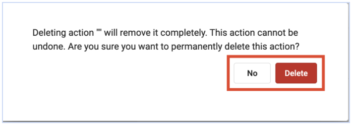{width=50%}

#### View Indicator Progress

To view the performance of the indicator over a period of time. Click on the chart icon.

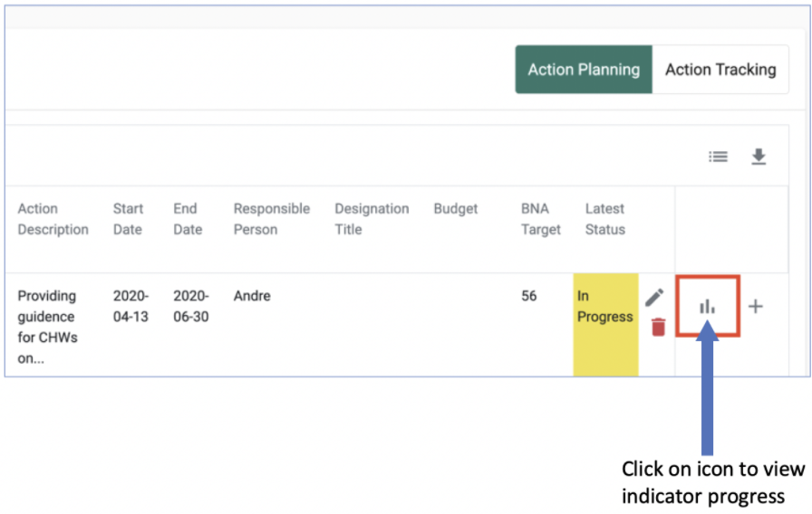{width=50%}

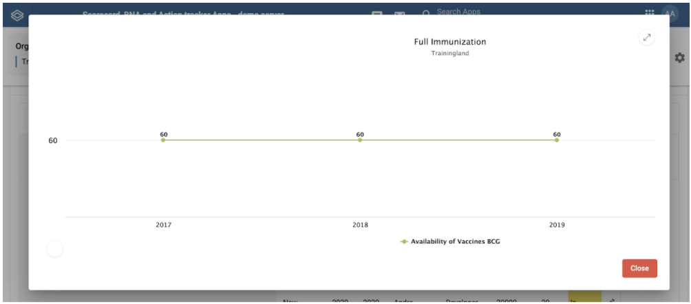{width=50%}

Hover over the graph points to view more details about the indicator.

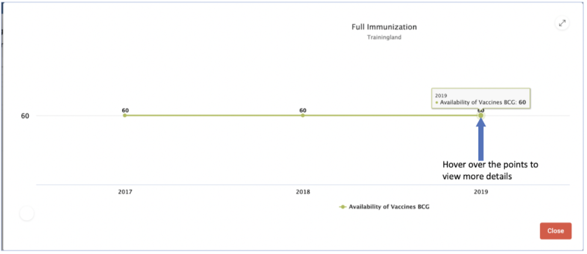{width=50%}

Click on the resize button to view the graph in full screen or to exit the full screen

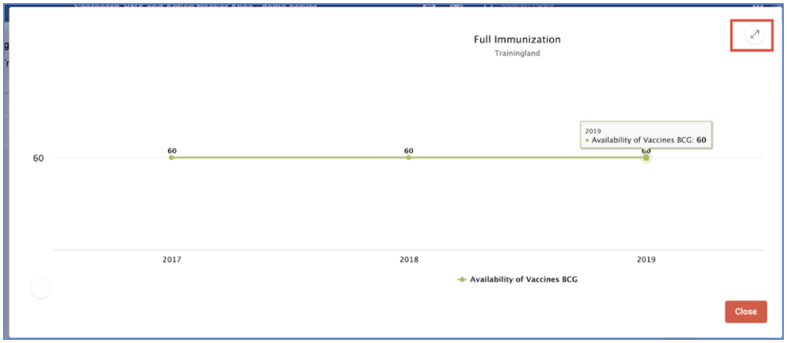{width=50%}

Click on the close tab to close the graph

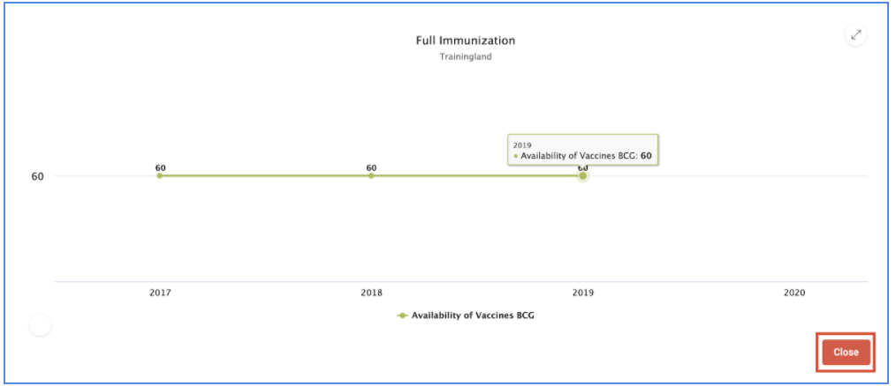{width=50%}

## Action Tracking in Action Tracker <!-- DHIS2-EDIT:https://github.com/hisptz/unicef-apps-docs/edit/master/src/commonmark/en/content/action_tracker/at-app-action-tracking.md -->

The action tracking section allows you to track progress of implementation of the  actions and allows users to update the implementation status of the and review. It provides updates of the status of actions; whether they are not done, in progress, completed or cancelled. It allows for comments on selected status and selection of a period when the action will be next reviewed.

### Action Tracking

To access the action tracking options, click on the Action Tracking tab.

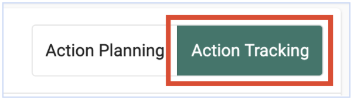{width=50%}

To update progress on implementation of an action, click on the add button in the reporting period

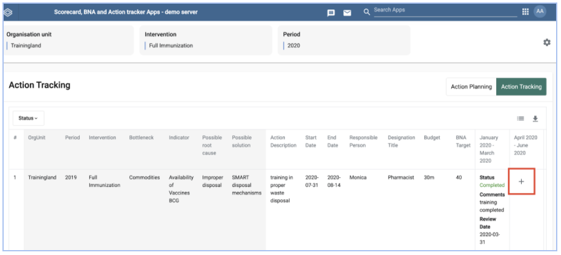{width=50%}

### Action Status

To select the action status, click on the drop down arrow to the extreme right under action status to select the current status of the action

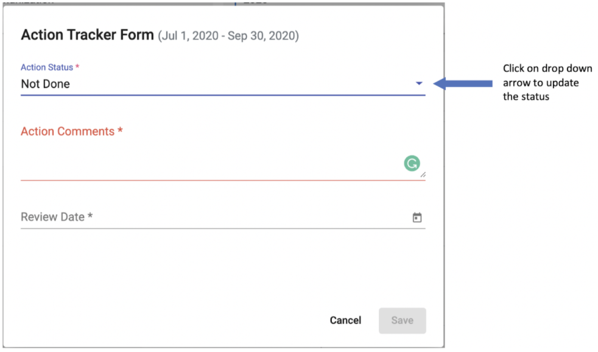{width=50%}

Select the current status of the action from the drop down list

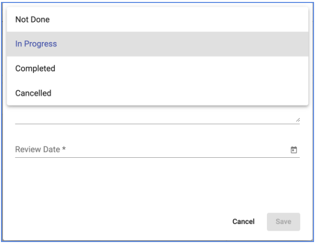{width=50%}

### Action Comments

Type in the Action comments section to provide more description of the selected status.

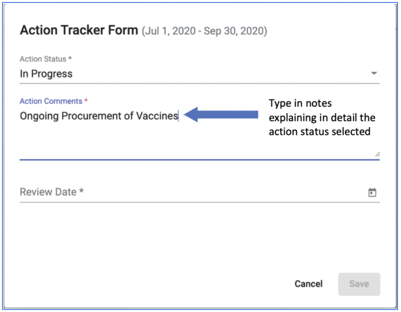{width=50%}

### Review Date

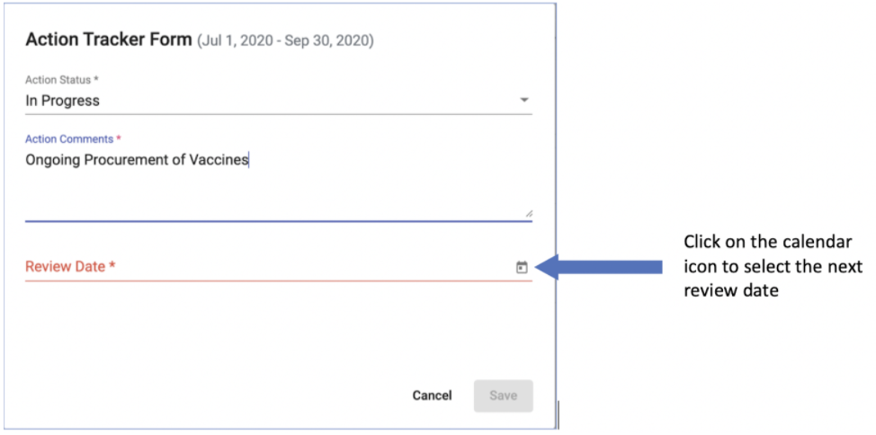{width=50%}

Select the date within the quarter when the action will next be reviewed.

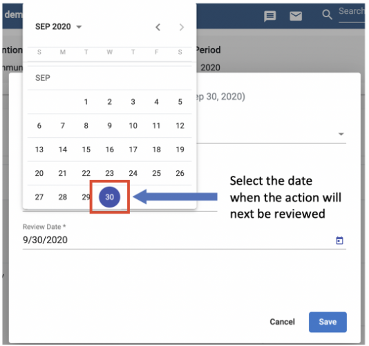{width=50%}

To save the updated action status. Click on the save button.

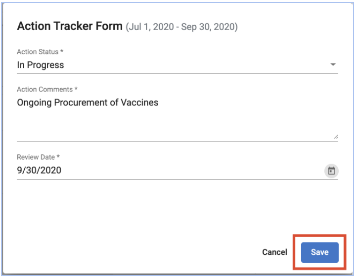{width=50%}

__Note:__

> The Save button is only activated when all the fields have been filled.

### Selecting Columns to be Displayed on the Table

To select columns to be displayed on the action tracking table, click on the list icon in the right corner above the table.

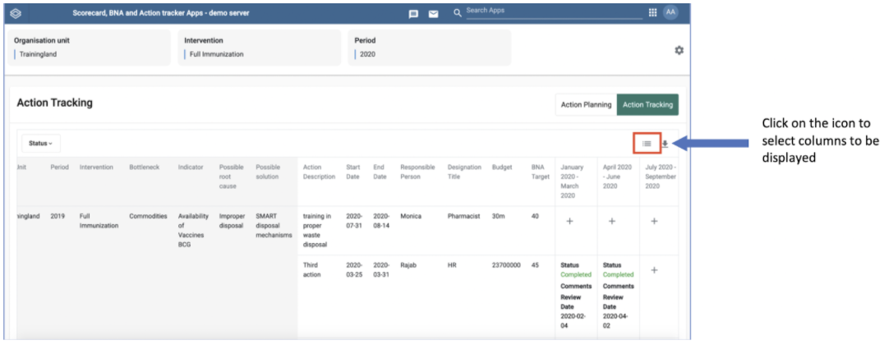{width=50%}

Check the boxes for the columns to be displayed on the table.

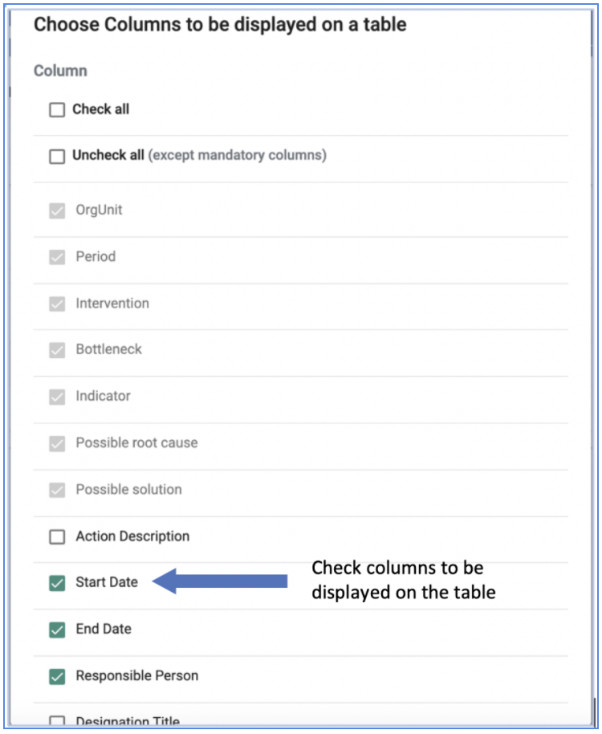{width=50%}

__Note:__

> Mandatory columns cannot be unchecked and will always be displayed on the table.

### Download List of Actions

To download list of actions tracked click on the export icon to get options of formats to download

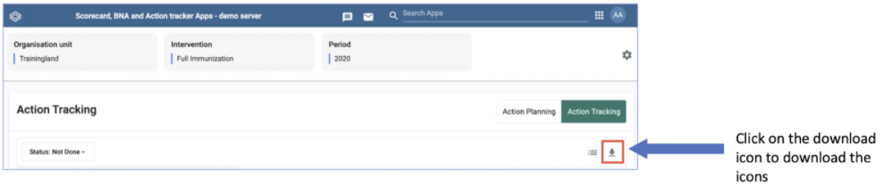{width=50%}

Select the preferred file format to download and follow steps on your browser for saving downloaded files. Available formats for download include CVS, Excel and PDF

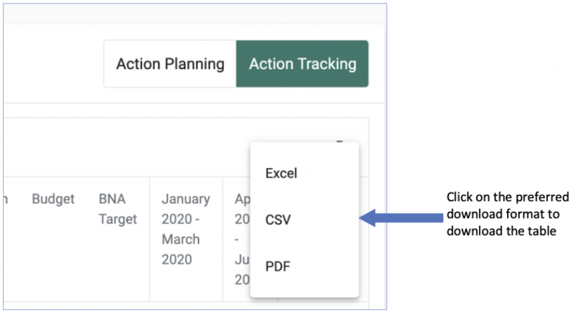{width=50%}

### Filter Actions

This allows one to select and display only actions of a particular status; not done, in progress, completed or cancelled in the table. To filter Actions to display in the table. Click on the status tab at the left upper side of the table.

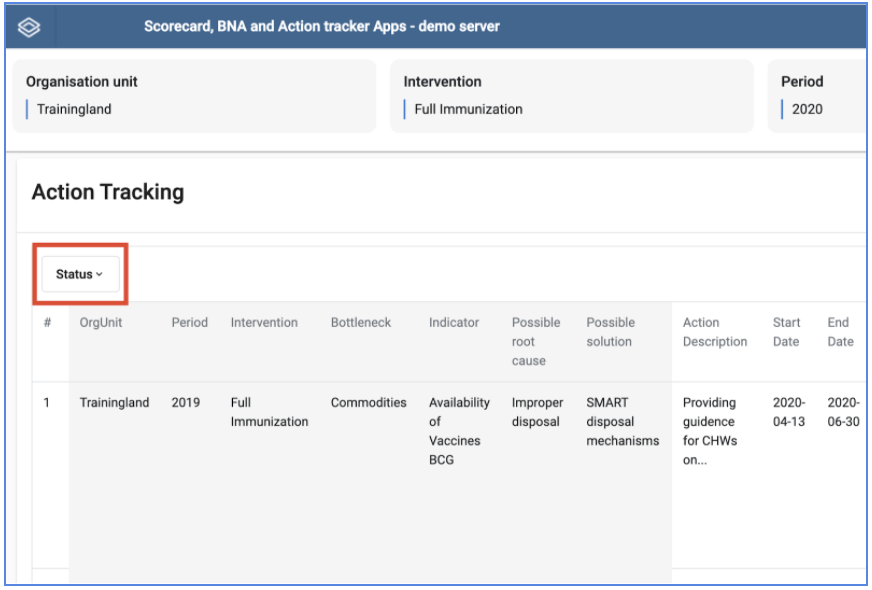{width=50%}

Select the preferred status; not done, in progress, completed or cancelled from the drop down list. This will only display actions of the selected status
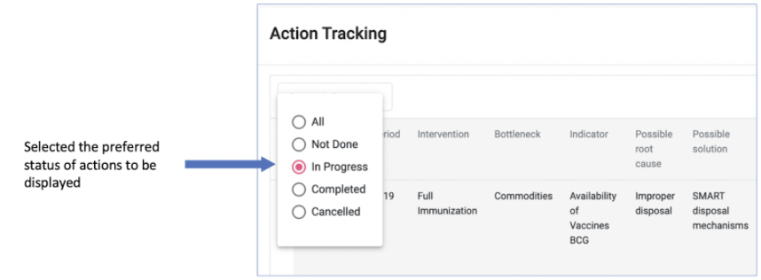{width=50%}

