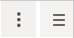

# Installation and Configuration

## Installing the BNA App <!-- DHIS2-EDIT:https://github.com/hisptz/unicef-apps-docs/edit/master/src/commonmark/en/content/bna/bna-app-installation.md -->

The BNA app is completely free and open source and available on the
[DHIS2 app store](https://play.dhis2.org/appstore/app/gFr0w6pDYbY).

To install an application in DHIS2, you require the superuser privilege.
Ensure your account has the necessary authority to install the application or
contact your DHIS2 support team for support in installing the app.			

> **NOTE**
>
> Interactive BNA app supports all versions of DHIS2 from 2.28 going upward,
It can run in lower versions limited functionalities and with no support for
fixing any issues.

There are two ways of installing bottleneck analysis app into your
DHIS2 instance.

### Installation from within DHIS2

This installation approach is the most direct, but only available on
DHIS2 running version 2.28 and above

Step 1:  Access app management from the apps selection menu

{width=50%}

Step 2: Once Apps management is open:
Go to the apps store panel and the list of online applications for installation
will show up.
Install the “Interactive Bottleneck Analysis” app and the “Bottleneck analysis”
app by clicking on install underneath the app name.

{width=70%}

When done installing, the BNA App will be accessible from the search menu.
Note: This step is only successful if you have an internet connection and your
DHIS2 instance is accessible online.

### Installation from DHIS2 App store website

Access the interactive bottleneck analysis and bottleneck root cause data entry
apps from the [DHIS2 app store](https://play.dhis2.org/appstore/). This approach
is recommended for all DHIS2 instances running on version 2.28 and above.

> **NOTE**
>
> Ensure that you have good and stable internet connection to download the
zip file. During installation, both the Root Cause and Interactive apps have to
be downloaded and installed.

{width=50%}

Step 1: Downloading  a compatible version from the app store
Once on the DHIS2 App store locate the BNA applications and select them to get
the list of available versions of the app. Select the latest version of the app
and download a zip file of the latest build into your local hard disk.

{width=70%}

> **NOTE**
>
> The zip file name may have a cryptic alphanumeric name such as
“727a1631-85e4-4313-be1f-b5f02f7e25e2”. You may want to rename the zip file to
easily locate it in the future with naming such as “Bottleneck App v1.0x.beta.zip”,
where “x” is version number of your build.

Step 2:  Access app management from the apps selection menu

{width=70%}

Open Apps management to see and manage list of installed applications on DHIS2,
bottleneck app can be installed by clicking the upload icon.

{width=5%}

Once installed the bottleneck analysis application will be enlisted under
standard apps

{width=70%}

When done installing, the bottleneck app will be accessible from the search menu.
If the bottleneck analysis app does not appear on your menu, it could be a result
of the following two issues.

1. Installation Access credentials/Permissions
  While the bottleneck analysis application may be installed within your DHIS2
	instances, you may not have the necessary permissions to view it. In these cases,
	communicate with your DHIS2 administrator or DHIS2 support team for the application
	to be assigned to one of your user roles.

2. Installation not successful
	 The bottleneck analysis application will not be visible in your application
	 if it has not been installed successfully. 			

	 > **NOTE**
	 >
	 >Most common failures related to installation results from
 misconfiguration of read/write permissions of the installation folder on the
 server hosting DHIS2 instance. Misconfiguration of permission can also result
 from denial of ability to delete an installed application.			

To resolve this, the administrator needs to access the back-end of DHIS2,
to assign proper ownership and read-write permission of the folder for holding
installed apps.			

> **NOTE**
>
>The location of the folder for installed apps varies depending on the
version of DHIS2 Installation.

1. From version 2.27 going back, the folder for installed apps is located in
   [DHIS2_HOME]/apps
2. From version 2.28 and above, the folder for installed apps is located in
   [DHIS2_HOME]/files/apps		
For more information on how to create and install applications on DHIS2
please visit https://www.dhis2.org/how-to-create-find-install-apps/ 		

## BNA App Maintenance <!-- DHIS2-EDIT:https://github.com/hisptz/unicef-apps-docs/edit/master/src/commonmark/en/content/bna/bna-app-maintenance.md -->

### Interventions and Indicators Configuration

If no Intervention created and assigned to the dashboard, BNA App loads with
predefined interventions, with predefined indicators named “indicator 1” for
each determinant. Sub-level analysis and root cause analysis will be empty.

Administrative users can create Interventions and assign them to the dashboard
for other users to access depending on the sharing access granted to them.

#### Creating Intervention

To create new intervention, administrative user can click on the blue plus sign
button just below list of interventions on the dashboard. Interventions are the
ones holding determinants which holds indicators.

{width=50%}

Then have to write the intervention name(eg. BEmOnC) and click create button to
save the intervention.

{width=50%}

__Note:__ Attempting creating an intervention that is existing, will  be denied
by the system and presented a message that the intervention is already existing.

{width=25%}

#### Interventions and Indicators configuration

Administrative users can configure interventions and indicators by clicking the
Settings button just below the intervention list on the dashboard to get the
setup page.

{width=50%}

Administrative needs to to share intervention for other users to access, set
the period for BNA presentation and analysis, decision to use indicator short
names as display names in the BNA chart, and legends for specified cut-off
points for indicator performance. Administrative users can change the colour
of each determinant group indicator(s).

{width=50%}

__Note:__ Bar charts of every indicator attached to a particular determinant
group will inherit the colour of that determinant group.

To add indicators into a determinant group, just click on the plus sign button
to get a list of indicators from indicators or functions to add to the
determinant group for BNA chart configuration.

#### Adding Indicators and Configuring legend-sets

Administrative users can add or remove indicators to and from determinants
groups by interacting through interface. To add an indicator to a determinant
group, users can click on the plus sign button to get a list of indicators or
functions to select and add.

Administrative users can configure cut-off points for poor, average, and good
performance for each indicator. Cut-off points are used in sub-level analysis
visualization.

{width=70%}

#### Access control and Sharing interventions

Interventions must be shared for other users and user groups to access.
Interventions work in the same way as DHIS 2 dashboards. If not shared, only
users who created them can access and manage. There are three sharing options
that administrative users can share opt to share intervention.

1. __Can View and edit:__ With this option, any user shared intervention with
   this privilege can access and edit it, including changing settings of items in
   it. This access should only be given to administrative users only.
2. __Can view only:__ Administrative users should select this option to share
   intervention with users who are supposed to access BNA chart and sub-level
   analysis and enter root causes. For BNA application context, view only is
   granted to district, regional and national users who are not supposed to make
   any changes to the settings.
3. __No Access:__ If you don’t want to share access to anyone.

{width=50%}

#### Setting Organization Unit and Period

Administrative user can set organization unit and period and save changes for
BNA charts to load with. If you set a particular district, all users will get
the BNA charts loading for a selected district. Although users can filter the
chart with their preferred organization unit and period, it may may confuse
them. So it is important administrative user to set ‘user organization unit’
as default period so that every user can have BNA chart for their levels
displayed. It is good practice to assign user organization unit so that every
user can access BNA chart and sub-level analysis relevant to their levels.

{width=50%}

#### Saving Configurations

After the administrator is satisfied with the filters that they have applied
for an intervention they have to save these configurations they have made for
the interventions. To save the configurations they simply have to click the
“Save Changes” button.

{width=70%}

 __Note:__ Editing and saving configurations of a shared intervention will
 reflect the new configurations to the district end user with whom the
 intervention has been shared with.

### Standard data analytics

Data which is entered into DHIS2 must first be processed with the DHIS2
“analytics” engine. This means that data is not immediately available in the
analytics resources (such as the BNA chart, sub-org unit  level analysis tables,  
  pivot tables, data visualizer, GIS or  report) after it has been entered. If
  scheduling is active, the analytics process will run automatically at midnight
  each day. After that, new data which was entered since the last time the
  analytics process ran, will become visible.

You can trigger the analytics process manually by selecting
__Reports->Analytics__ from the main menu and pressing the “Start export” button.
Note, the process may take a significant amount of time depending on the amount
of data in your database.

### Functions data analytics

Functions selections are extended analytics calculations supporting a more
open-ended logic of computation, such as logical operations, predictors and
other complex analytics use cases.
To create functions to work with BNA App,
download function maintenance application from this link: <https://play.dhis2.org/appstore/app/dXX2Fk6jwCX>. Functions makes
use of pure good old JavaScript(vanilla JavaScript) logic to do calculations
purely on the browser, without the need for a server. This is accomplished by
execution of JavaScript codes that expects period and data selections and return
standard DHIS2 analytics results.
Functions selections are extended analytics
calculations supporting a more open-ended logic of computation, such as logical
operations, predictors and other complex analytics use cases.

### Maintenance of Indicator functions

Functions comprises of three key building blocks:

4. __Input/Selection parameters:__ Function expects standard DHIS2 periods and
   organization units selections.
5. __Computation logic:__ This is an open-ended workspace for writing of
   calculation logic to work on given period and organization unit selections,
   computation logic is usually classified into rules dimensions, thus allowing
   one function to support different use cases by defining multiple rules that
   will control the computation logic. Possibilities are limitless, among major
   operations done includes.
       1\. Fetching data from aggregate and event analytics and modifying results
       with custom logic, and reformat the results back in standard analytics format.
       2\. Fetching data from existing sql Views, performing custom logics and
       formatting results in standard analytics format.
       3\. Fetching data from other DHIS2 API endpoints(such as data-value and
         events api) and other data sources(including external sources), performing
         custom logic and formatting results in standard analytics format.

6. __Output/Returned analytics__: This is the end-result output from functions,
   formatted in 	standard analytics format, to allow compatibility with standard
   DHIS2 analytics applications. To support open-ended support for any level of
   complexity, function maintenance application has been developed, to allow any
   developer with basic JavaScript knowledge to quickly develop custom calculations
   either not supported natively by DHIS2 or to allow developers to work-around
   limitations or miscalculations from standard analytics.

Main requirements for developing functions includes:

* Basic web programming knowledge with JavaScript (jQuery is an advantage).
* Understanding of DHIS2 Web API and analytics.
* A working installation of Functions maintenance application. When a function
  maintenance application is installed for the first time, it creates five standard
  functions  with generic use cases as example functions to allow reuse of codes to
  create other functions. The auto created functions will also be listed in the
  functions selection list.

> __CAUTION__
>
> Sharing settings from 2.28 going back is only implemented on the
> interface, access control is not strictly enforced, it is for simplicity in
> management of BNA Interventions only through the datastore.

> __NOTE__
>
> User groups appearing on the access sharing list should exist in the user
> groups that were created in the “Users” app.

#### Bookmark an Intervention

To bookmark an intervention an administrative user will have to simply head on
to the control options found just below the list of interventions next to the
share icon there is a bookmark icon. Clicking the icon will bookmark the dashboard
that you are currently viewing. The name of the dashboard you are currently viewing
is also displayed on this control area.

{width=70%}

#### Deleting an Intervention

The BNA App allows deletion  of an intervention from the system whenever necessary.
Deleting intervention means you delete all indicators, bottleneck charts, sub-level
analysis and root cause analysis created under that intervention. This is why before
deleting, you will be asked to confirm if you are sure you want to delete it,
where you will click “yes” to delete or “no” to cancel.
To delete an intervention, the administrative user can:
1\. Go to search for intervention just allocated on the right hand side of
adding new intervention icon and
2\. click the delete icon next to edit button on the the specific intervention.
3\. Select an intervention from the list, and click “DELETE” button on the far
right side of the App and confirming deletion by clicking ‘yes’ option.

{width=25%}

{width=25%}

### BNA Widgets setup

#### Accessing Widgets

BNA Widgets are meant to mainly be accessed by users at district levels.
Widget is a separate application that is installed in DHIS2 instance to work with
BNA Application. In case you don't find it in your DHIS2 instance, go to
App Management in the DHIS2 global menu to install it.

{width=70%}

{width=70%}

#### Setting up Widgets

At first glance, when the administrator has installed the BNA Application into
a clean instance the root cause analysis data entry component of the intervention
will display a message prompting the user to head over to the DHIS2 Appstore and
download the “Root Cause Analysis Data Entry Widget”.
Detailed information on how to install an application from the DHIS2 app store
can be found in chapter 2.

If BNA application is taking too long to load, and you’re not on a slow
network, make sure you have cleared your browser cache.

BNA Application makes good use of cached files for better offline
experience, as a result, when installing higher version, BNA Application
may use older version of cached files and thus break down while loading.

### Clearing application cache

Approaches to clear application cache and browser interface, vary from
browser to browser; for example for Mozilla Firefox the keyboard
shortcut is “CTRL+SHIFT+DELETE” while for Google chrome the keyboard
shortcut is “CTRL+SHIFT+J”.

Accessing interface for clearing browser cache can be done via the
following approaches:               • Google chrome​: Go to the menu
icon on the top right corner, and click it to open, go to more tools
menu, and choose “Clear browsing data”. Once interface is open, Make
sure, “Clear the following items from” is set to “The beginning of
time”.                                 

• Mozilla Firefox​: Go to the menu icon on the top right corner, and
click it to open, go to ->Library, and go to History, and choose “Clear
recent history”. Once interface is open, Make sure “Time range to clear”
is set to “Everything”, and “Details” option is expanded to show all
details options. Once on the clear browsing data or recent history, tick
“Cache”, “Cookies”, “Hosted app data” or “Offline Website data”. To
clear all cached files, cookies and locally stored data by bottleneck
.        

 {width=10%}

> __NOTE__
>
> These will also clear all cache information
> and cookies from other websites you visited in your browser.

{width=70%}

{width=70%}

### BNA App Error Messages

The BNA Application has error messages for the expected errors that
could occur. For example attempting to access metadata that no longer
exists in the system.

