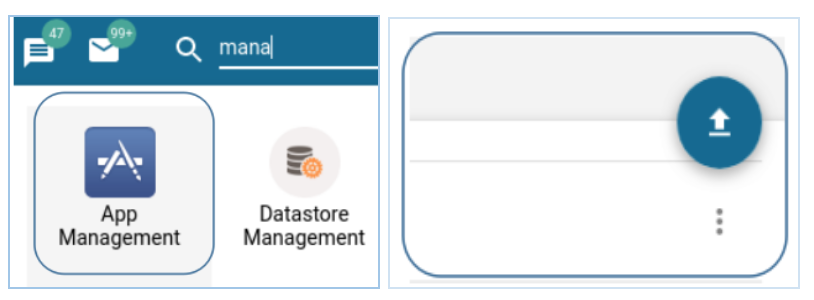
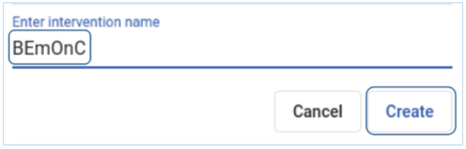
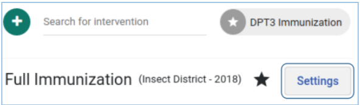
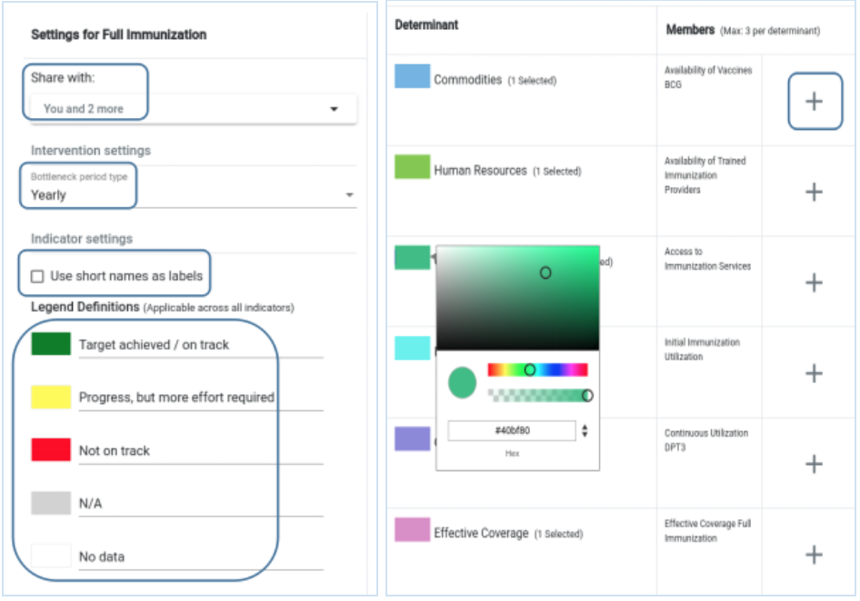
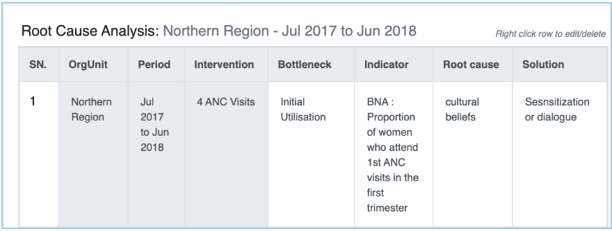
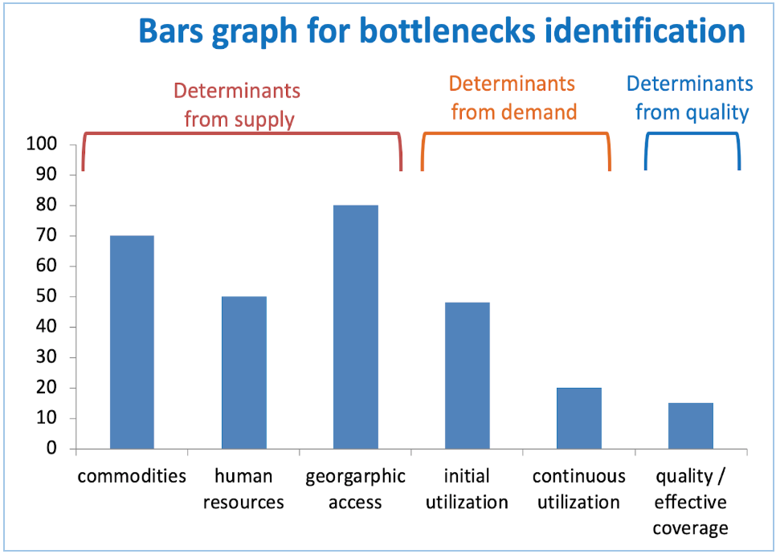
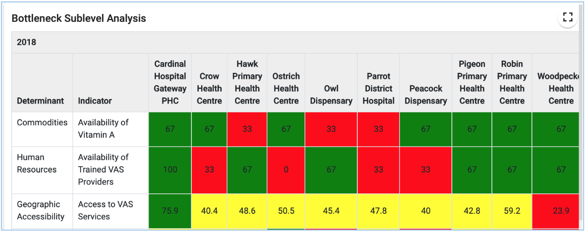

# User Implementation

## Guide to BNA App Implementation <!-- DHIS2-EDIT:https://github.com/hisptz/unicef-apps-docs/edit/master/src/commonmark/en/content/bna/guide-to-bna-app-implementation.md -->

This guide will provide a detailed overview of the different facets of the
BNA App implementation.

### BNA App implementation guiding principles
The BNA App implementation is part of a comprehensive approach to analyse key
health barriers, identify and prioritize the most significant health system
bottlenecks, determine their causes and develop realistic actions to address
priority constraints at the sub-national level. To achieve this, Ministries of
Health and other bottleneck analysis users should consider taking up the
following guiding principles to successfully implement the application.

1. Ensure that before implementation (within the Ministry of Health) inclusive
discussions with all stakeholders are undertaken to streamline the process,
i.e. MoH (Program & data managers, ICT, M&E teams), stakeholders (Implementing
  and development partners)
2. For the case of MoH, ensure that there exists a functional DHIS2 instance at
 the national level with required datasets that provide data for at least the
 6 determinants of coverage (Commodities, Human Resource, Geographical Access,
   Initial Utilization, Continuous Utilization and Effective Coverage )
3. Work with MoH teams (M&E, Program and Data Managers) to develop the BNA list
of indicators. Important to ensure that indicators can easily be generated from
 the DHIS2 or other nationally available sources.

For sources such census, and survey reports, plan to create a dataset with the
DHIS2 system to facilitate import.

For systems that are not integrated within the DHIS2 system, data can be
exported in spreadsheets and subsequently imported for purposes of generating
the bottleneck analysis charts.

Lookout for denominator issues and indicators that require complex calculations.
You could opt to use proxies or any other relevant indicator that provide data
for the bottleneck analysis.

4. Once the BNA indicator list has been completed, work with the MoH technical
teams to map indicators to the DHIS2 system data elements / Indicators.
5. Ensure that the DHIS2 instance has been upgraded to at least dhis2 2.28 and
above. The BNA app works well in DHIS2 instances starting with v2.28 - v2.33.
6. Obtain the BNA app installer from [Dhis2 app store](https://play.dhis2.org/appstore/)
 by either downloading directly from the site and installing the app in the
 DHIS2 system or installing from with the DHIS2 app management module
 ( follow the [installation manual](https://docs.dhis2.org/master/en/bna-app/html/dhis2_bottleneck_analysis_manual_full.html#installing-the-bna-app) to
complete the setup)
7. Use  the [BNA configuration guide](https://docs.dhis2.org/master/en/bna-app/html/dhis2_bottleneck_analysis_manual_full.html#navigating-the-bna-app) to complete
setup for the BNA charts, sub-level and root-cause analysis. Part of the
configuration includes sharing the BNA charts with national and district users,
setting permissions and protocols for access.
8. To ensure the quality of data generated by the BNA charts, both technical,
program and data managers need to validate the data outputs by comparing with
other DHIS2 tools in the system such as pivot tables, data visualizers and
dataset reports.
9. Plan and conduct BNA app trainings at both national (ToT) and the district
levels.

## Planning and organising <!-- DHIS2-EDIT:https://github.com/hisptz/unicef-apps-docs/edit/master/src/commonmark/en/content/bna/planning-and-organising.md -->

**_Stakeholders:_** It is important to identify the stakeholders who will
participate in the implementation of BNA App and associated activities.
Key stakeholders may include but not limited to the Ministry of Health,
district staff, UNICEF staff, development and implementing partners

**_BNA Core Team (BCT):_** 3-5 people will need to be identified and given the
roles and responsibilities of administering the bottleneck analysis app. The
core team (ICT and data analysis proficient) support setup and configuration
will participate in testing and training activities, organizing and supporting
end-user in various groups.

**_Technical Steering Committee:_** A committee composed of MoH and UNICEF will
 be needed to coordinate the BNA implementation across various health programs
 (Malaria, nutrition, reproductive health etc). The committee will lead
 integration of DHIS2 with other legacy systems ( Human resources Systems,
   LAB systems and Logistics)  and make decisions regarding the overall
   architecture and functioning of the BNA app.

**_Identifying users:_** Users of the BNA app should be cross-cutting from
program managers at the national level to district and facility users at lower
levels of implementation.  To organize BNA implementation, it is important to
group the users for easy management and assigning system privileges. Some
examples of user groups include National users, District Users, Facility Users.

## Adopting the use of the BNA App <!-- DHIS2-EDIT:https://github.com/hisptz/unicef-apps-docs/edit/master/src/commonmark/en/content/bna/adopting-the-use-of-the-bna-app.md -->

### Scope of the App

1.  Based on the decisions the system should support (system scope);
    customization and adaptation of the BNA app will be needed. Each
    action will need special competence, and should be led by the core
    team.
2.  Assessment of the intended users and beneficiaries is important, as
    well as their information, and hardware and network needs.
3.  An understanding of the larger architecture of the national HIS is
    important; consideration for what other systems are in place, and
    how they should interact with BNA app? Also consider what needs
    there will be for interoperability between electronic systems.
4.  If there are needs that are not currently supported by DHIS2, an
    assessment of additional software development is necessary. For
    example population data, HR data and denominator calculations not
    supported with the main DHIS2 core. These can be addressed locally
    by developing a custom web app or feed into the overall core
    platform development roadmap process organized by UiO.

### Setup and configuration

1.  Functionality of bottleneck analysis requires to carefully review
    meta-data before setup and configuration. The review should be led
    and spearheaded by the core team.
2.  Ensure that all required meta-data (data elements, organisation
    units, datasets and indicators ) are properly configured in the host
    system.
3.  Additional requirements such as data elements for calculating
    denominators should be carefully analysed and setup in the host
    system. In cases where data is to be imported from other legacy
    systems, an integration process need to be in place.
4.  Users and their appropriate roles need to be defined first in the
    DHIS2 and then in the BNA app for proper management.

## Capacity building <!-- DHIS2-EDIT:https://github.com/hisptz/unicef-apps-docs/edit/master/src/commonmark/en/content/bna/capacity-building.md -->

### National Core Team (NCT)

The National core team will need all the necessary skills (M&E, Data and ICT teams) to support BNA app implementation and bottleneck analysis in general. Both BNA app end-user and technical skills will be required in this case.

1. **_User skills_**: Ability to generate, analysis and interpret BNA charts, enter root causes for identified gaps, etc
2. **_Technical Skills:_** know how to setup BNA indicators on charts, configure user access and sharing

### Training strategies and preparations

1. **_National Core Team engagement:_** The national core team should be prepared to offer continuous training to both national and district level users in accordance with BNA implementation guidelines.

    The core team should routinely review, identify and share the feedback on BNA app use cases with the development teams at HISP and UiO.

2. **_Customization of training materials:_** Training material and reference guides to reflect local information needs and local system content should be adopted. The core team should play a key role in ensuring training materials are up-to-date and conform to the country standards.
3. **_Development of implementation materials: _** Materials for the BNA implementation should be reviewed and developed by the national core team. These may include the Implementation guide, end-user and administrators guide. Were necessary, step-by-step guides should also be developed to enhance the training sessions.
4. **_User acceptance testing:_** This training is aimed at field testing the features and functions of the BNA app. The training can be organised into two categories of users, administrators and end-users. The purpose is to gauge the ability of users to interact with the app and use it for bna analysis.
5. **_Training of Trainers:_** Part of the processes to build capacity for support and implementation of BNA is putting in place a national core team. The ToT is aimed at training and building the capacity of a national core team to support BNA configuration and use at both national and lower levels. A team of 5-10 professional staff should be identified, trained and equipped to support the implementation.

### End User training

Important tasks to note for the end user training are the roles and responsibilities of various users who will interact with the BNA App. These will depend on two factors, what the person will be doing, and where the user is located.

1. **_Identify required training: _** The most common tasks required for BNA app training will include, Data analysis processing, preparing reports and other information products. The development team should endeavour to work with stakeholders (MoH and Unicef) to plan trainings that have an impact on the users. App  maintenance - managing users, changes on indicators and data elements.
2. **_Workshops and onsite training: _** 1-2 workshops should be organised and conducted in an effort to support BNA app implementation. a) Workshop for indicator  identification and mapping, b) Training and capacity building workshop during implementation. Additionally, for lower levels such as facilities, on-site training sessions should be conducted to facilitate hands-on exercises. The on-site training sessions should be decentralized and preferably conducted by the District Health Management Team (DHMT) in conjunction with the MoH
3. **_Focused groups training: _** Focused group trainings on use of BNA app should be adopted to allow maximum benefit for the participants. Sub-national level meetings such District Committee, District Health Management meetings should serve as avenues to discuss bottlenecks and mitigation approaches.
4. **_Mentorship and support supervision:_** Six-monthly onsite support supervision and training on the use of BNA app should be planned and conducted. This will help identify gaps in the BNA app implementation process and generate actions.

## Setting-up a new BNA App <!-- DHIS2-EDIT:https://github.com/hisptz/unicef-apps-docs/edit/master/src/commonmark/en/content/bna/setting-up-a-new-bna-app.md -->

The BNA App utilizes available metadata and data in the DHIS2 instance. It is
important to ensure that metadata are properly configured prior to installing
the app. The development team has put together pre-configured metadata for
sample indicators found [here](https://drive.google.com/open?id=1HFwRrGrXHWOh7BxMvu0c2_FMXW7TMpzQYQjGCgz58_4). You can download these and use them as an example to setup a local BNA app use case

Best Practices for starting up a new BNA app implementation

The following section describes a list of tips for getting off to a good start
when setting up and implementing the bottleneck analysis app.

1. Identify a real life use case to use in the BNA process.
2. Discuss and identify priority indicators to use in the BNA process.
3. Quickly populate a demo instance, include examples of BNA charts, tables and
 dashboard. Use real data, ideally nationwide, but not necessarily facility-level
 data.
4. Put the demo database online. Server hosting with an external provider can be
 a solution to speed up the process, even if temporary. This makes a great
 collaborative platform and dissemination tool to get buy-in from stakeholders.
5. The next phase is a more elaborate BNA implementation process. Parts of the
demo can be reused if viable.
6. Make sure to have a local team with different skills and background: public
health, data administrator, IT and project management.
7. The core national team should drive the implementation process but be
supported and guided by experienced stakeholders.

### Installing the BNA App

BNA App can be installed into DHIS 2 system in two ways like other DHIS 2
applications.

1. If the application has been uploaded into the play store, users can browse
from DHIS 2 [App store](https://play.dhis2.org/appstore/) to download it.
Installation from App store is simply clicking the application and it will be
installed. Users can refresh the page to see BNA App in the DHIS 2 menu.
2. If the application has not been uploaded into DHIS 2 App store, users can get
 the zipped file and upload into the App manager. App Management access needs to
  be accessed with users who have permission to access and manage Apps. after
  opening App Management, a user is required to click an upward arrow to get
  options to select file for uploading.
  {width=60%}

Best practices for configuration
1. Functionality of bottleneck analysis requires to carefully review meta-data
before setup and configuration. The review should be led and spearheaded by the
core team.
2. Stakeholders are advised to select tracer intervention that will best
represent/identify barriers to health care service delivery.
3. Ensure that all required meta-data (data elements, organisation units,
  datasets and indicators ) are properly configured in the host system.
4. Additional requirements such as data elements for calculating denominators

should be carefully analysed and setup in the host system. In cases where data
is to be imported from other legacy systems, an integration process need to be
in place.
5. Users and their appropriate roles need to be defined first in the DHIS2 and
then in the BNA app for proper management.           

### BNA Access and Navigation

Once installed, BNA App can be initiated by searching it from DHIS 2 menu and
click it  to open. At the first time if no intervention has been configured,
BNA App will load with predefined interventions, with predefined indicators
named “indicator 1” for each determinant. Sub-level analysis and root cause
analysis will be empty. Predefined interventions are replaced with user defined
interventions with configured indicators for each determinant group of every
intervention.

## Data and Metadata

The bottleneck analysis app, works well within existing DHIS2 instance. The app
is well supported in DHIS 2 version 2.28 onwards. The app utilizes existing data
 and metadata in the DHIS2 system to generate BNA charts. BNA app is meant to
 utilize data reported in DHIS 2 system directly or from external systems after
 being integrated or imported into DHIS 2. Data from external systems needs to
 be stored in placeholders created in DHIS 2 for definition of indicators.

### Datasets and Data elements

Data elements are the most critical part of the DHIS 2. For the bottleneck
analysis app to work, it needs indicators generated from data elements within
DHIS 2. Data elements are critical for collection, aggregation and analysis of
Health data. The DHIS 2 support team needs to ensure that most of the data for
BNA app can be generated from the DHIS 2 system.

Some of the data required for the generating BNA charts may be from other sources
that are not pushing data in the DHIS2 for example Human Resource for Health data,
 population data, data from survey report; in such cases, it is important for the
 support team to create data elements / datasets to act as place holders for data
  from external sources. Once the datasets have been created, then data can be
  adequately imported into the DHIS2 system for generating indicators that aid
  the creation of BNA charts. Data elements and data sets are created in DHIS 2
  maintenance App, and can be used for BNA charts and other analysis tools such
  as pivot tables etc. You can learn more on [data element](https://docs.dhis2.org/2.30/en/user/html/dhis2_user_manual_en_full.html#manage_data_element)
  in and [Data set](https://docs.dhis2.org/2.30/en/user/html/dhis2_user_manual_en_full.html#manage_data_set)
  in DHIS 2 Documentation.   

### Indicator mapping and configuration

Indicator mapping and definition are critical for the BNA process to be successful.
Once stakeholders have collaboratively identified interventions and indicators,
best practice is to put indicators for each intervention in the document for
reference purposes. For each indicator, it is important to identify the numerator
 and denominator together with their sources. Mapping document will guide the
 configuration and support team during mapping to know the sources, data element
  place holders for storing data from external systems and other calculations
  methods to use. The mapping document should have details of indicators to be
  collected; numerators, denominators, methods of collection and calculation to
   provide adequate information to the development team.

### Intervention creation

BNA App allows administrative user to create interventions. If no interventions
created, users will only see the default interventions with “indicator 1” labels
 but no data. To create new intervention, user needs to click on the blue plus
 sign button just below list of interventions on the dashboard. Interventions
 are the ones holding determinants which holds indicators.

{width=20%}

Then have to write the intervention name and click create button to save the
intervention.
{width=60%}

**Note**: Administrative users are the ones to create interventions and share
to other users to manage and view.  

### Interventions and Indicators configuration

Interventions, determinants, and indicators must be properly configured for
correct visualization of BNA charts and sub-level analysis. To configure
interventions and indicators, administrative user can click the Settings button
just below the intervention list on the dashboard to get the setup page.

{width=60%}

Clicking the Setting button will present a configuration window for administrative
user to set choose who to share intervention with, set the period for
BNA presentation and analysis, decision to use indicator short names as display
names in the BNA chart, and legends for specified cut-off points for indicator
performance. In BNA, administrative user can change the colour of each
determinant group indicator(s). Bar chart of every indicator attached to a
particular determinant group will inherit the colour of that determinant group.
 To add indicators into determinant group, just click on the plus sign button
 to get list of indicators from indicators or functions to add to the determinant
 group for BNA chart configuration.

####

{width=60%}
**Note**: Ticking “Use short names as labels” option

### Data entry and storage

The BNA app accepts entry of data for the root cause analysis component.
The main fields captured include the possible root cause and solutions for the
gaps in implementation of an intervention.

{width=60%}

The entry of root causes and solutions should follow a comprehensive process of
 causality analysis usually done during the District Health Management Team
 meetings. The “ADD” button on the root cause analysis component will facilitate
  entry and allow you to add as many causes and solutions as possible.

**Note**: These records will also be useful during the planning cycle where
district teams will formulate action plans and a monitoring framework for them.  

Configuration data for indicators and data from root causes analysis are stored
in the DHIS2 “Data store”. The data store is resident on the server hosting the
DHIS2 instance and can be modified using the DHIS2 data store management app.
Data contained in indicators are saved in DHIS 2 database.

**Note**: i. When the BNA App is uninstalled from the DHIS2, the data stored
remains, unless  if the data stored is removed.

ii.  Access to the BNA datastore is limited to system administrators only

### Data analysis and presentation

Data analysis and presentation on the BNA app is based on the Tanahashi Model
for health systems strengthening and strategic planning. The model emphasises
6 determinants of coverage (Availability of Commodities, Availability of Human
  Resources, Access to health facilities, Initial utilization of health services,
  Continuous utilization and Effective Coverage.)

Data visualization is interactive with dynamic relative periods and organisation
units. BNA charts will also be automatically generated once DHIS2 data has been
updated.

{width=60%}

**Note**: The golden rule for analyzing BNA charts is  “The demand side cannot
be higher than the lowest bar in the supply side” where the denominator is the
same. Additional guidance [here](https://www.who.int/bulletin/volumes/93/6/14-141879/en/)

Data on the BNA chart is further displayed in a sub-national level tables to
show performance of facilities using a scorecard colors (Red, Amber & Green).

{width=60%}

Data entered in the BNA app using the root cause analysis feature can be analyzed
based on the organisation unit, and period of analysis.

**Note**: all the data presentation charts, tables and reports can be downloaded
to either Excel, PDF or Word.

### Rollout and Implementation strategies

1. The rollout team should give thought to scale-up of the bottleneck app,
following  a successful user acceptance testing phase. The rollout should consider
 sustainability efforts including support within the MoH structure.
2. The core team should play a key role here and each member should have clear
responsibilities for the roll-out covering: user support, user training, liaison
with health programs, etc.
3. Broader support structures need to be established to provide support,
supervision, and communication with global/regional network of expert users and
 developers.
4. Information use must be a focus area from the start and be a component both
in the initial system design and the first round of user training.
5. District Health Team (DHT) review meetings and or equivalent should be
supported with appropriate BNA information packages and training.
6. Training will typically be the largest investment over time, and necessitates
 structures for continuous opportunities. Plan for a long term training approach
  catering for a continuous process of enabling new users and existing users on
  new system functionalities.

## End User training <!-- DHIS2-EDIT:https://github.com/hisptz/unicef-apps-docs/edit/master/src/commonmark/en/content/bna/end-user-training.md -->

Important tasks to note for the end user training are the roles and
responsibilities of various users who will interact with the BNA App.
These will depend on two factors, what the person will be doing, and
where the user is located.

### Identify required training

The most common tasks required for BNA training will include, Data
analysis processing, preparing reports and other information products.
The development team should endeavour to work with stakeholders (MoH and
Unicef) to plan trainings that have an impact on the users.

App  maintenance - managing users, changes on indicators and data
elements.

### Develop training strategies

#### User acceptance testing

This training is aimed at field testing the features and functions of
the BNA app. The training can be organised into two categories of users,
administrators and end-users. The purpose is to gauge the ability of
users to interact with the app and use it for bna analysis.

#### Training of Trainers

Part of the processes to build capacity for support and implementation
of BNA is putting in place a national core team. The ToT is aimed at
training and building the capacity of a national core team to support
BNA configuration and use at both national and lower levels.

A team of 5-10 professional staff should be identified, trained and
equipped to support the implementation.

#### Workshops and onsite training

1-2 workshops should be conducted in an effort to support bna
implementation. a) Workshop for indicator  identification and mapping,
b) Training and capacity building workshop during implementation.

 

Additionally, for lower levels such as facilities, on-site training
sessions should be conducted to facilitate hands-on exercises. The
on-site training sessions should be decentralized and preferably
conducted by the District Health Management Team (DHMT) in conjunction
with the MoH

#### Mentorship and support supervision

Six-monthly onsite support supervision and training should be planned
and conducted. This will help identify gaps in the bna implementation
process and generate actions.

### Materials and outcomes

Materials for the bna implementation should be reviewed and developed by
the national core team. These may include the Implementation guide,
end-user and administrators guide. Were necessary, step-by-step guides
should also be developed to enhance the training sessions.

## Integration Concepts for the BNA App. <!-- DHIS2-EDIT:https://github.com/hisptz/unicef-apps-docs/edit/master/src/commonmark/en/content/bna/integration-concepts-for-the-bna-app.md -->

Detailed information on DHIS2 Interoperability and
Integration can be found [here](https://docs.dhis2.org/master/en/implementer/html/dhis2_implementation_guide_full.html)

## BNA App Support and Scale-up <!-- DHIS2-EDIT:https://github.com/hisptz/unicef-apps-docs/edit/master/src/commonmark/en/content/bna/bna-app-support-and-scale-up.md -->

An important element in the scale and support for BNA implementation is
support, both technical and end-user. BNA was developed as part of the
DHIS2 platform and as such benefits from the vast community support both
in-country  and globally.

###  DHIS2 Home and JIRA

The DHIS2 home can be found
[Here](https://www.dhis2.org/),
with rich documentation on use of the platform. Support for DHIS is
reinforced by the a community platform
([JIRA](https://jira.dhis2.org))
where users commit tickets to seek for support on an identified issue.

Note: JIRA is open to everyone.

1.  Go to:
    [https://jira.dhis2.org](https://jira.dhis2.org/).
2.  Create an account with your name and email address.

#### Reporting and an Issues  

Uncertain whether something is a missing feature, a bug or deprecated?
We’d really appreciate that you ask on the developer list before
reporting a bug directly. Thanks\!

1.  Click Create in the top menu.
1.  Select a Project from the list.
1.  Select an Issue Type :

    1.  Improvement - if you’d like to tell us about something that could be
        better such as usability or design suggestions.
    2.  New feature - if you want to suggest a feature.
    3.  Task - if you’ve been asked to work on a DHIS2 task.
    4.  Bug - if you’ve found something that needs fixing.
    5.  Epic - if you’d like to submit an idea for a new DHIS2 area such as
        an app. Epic is used for issues more complex than new features.

1.  Click Create .
1.  Tip
1. To create several issues in one go, select Create another .
1. Fill out the issue form. Please give us plenty of context\! Include
    server logs, JavaScript console logs, the DHIS2 version and the web
    browser you’re using.

#### Feedback and Communication

To share information, clarify requirements, or discuss details about an
issue, do this using issue comments.

1. Select the issue you want to comment.
1. In the Issue Detail view click Comment and enter your text.
1. To email others about your comment, simply enter \*\*\@User ‘s
    Name\*\* in the comment field. An email will be sent to the users’
    email addresses that are registered with their JIRA accounts.
1. Click Add.

### Use the community of practice 

Make use of the DHIS2 Community of practice to share experiences, post
and request for support on a topic of your interest.

1.  Ensure to create an account for yourself follow the guidelines
    below;
2.  Read the [community
    guidelines](https://community.dhis2.org/guidelines)
3.  [Claim your existing
    account](https://community.dhis2.org/t/-/14) or
    create a new account
4.  Add a profile picture and [introduce
    yourself](https://community.dhis2.org/t/-/15) to
    the community
    {width=40px}
5.  Read all the [category
    descriptions](https://community.dhis2.org/categories) to
    learn where posts go

## Opportunities and Challenges <!-- DHIS2-EDIT:https://github.com/hisptz/unicef-apps-docs/edit/master/src/commonmark/en/content/bna/opportunities-and-challenges.md -->

### Opportunities

1.  Planning and organising the BNA implementation will ensure by-in
    from Ministry of Health for usability and sustainability of the
    bottleneck application.
2.  Development and implementation of bna  will trigger national
    interest, leading to greater use of DHIS2 at district and national
    levels
3.  Bottleneck and causal analysis are useful for evidence based
    planning and can be used as a tools for resource mobilization.
4.  Aligning health program interventions to the already existing
    national planning cycles and systems during  the planning process.
    This will

    1.  Foster Government buy in
    2.  Build local ownership
    3.  Lower costs of implementation.

### Challenges

1.  Scheduling BNA activities within the national calendar will
    sometimes become challenging causing delays in reaching consensus.
2.  Infrastructure requirements such as internet in some districts may
    delay the implementation.

## Scale-up and sustainability <!-- DHIS2-EDIT:https://github.com/hisptz/unicef-apps-docs/edit/master/src/commonmark/en/content/bna/scale-up-and-sustainability.md -->

Beginning with a pilot is often good as it provides guidance on areas
that need most attention. Piloting provides cost estimates that can be
used for scaleup projections. Below some factors to consider for scaling
up implementation of the bottleneck analysis;

1.  Availability of technical support: The BNA App is currently
    supported by UiO/HISP nodes in east africa. This support is critical
    to build local capacity for customization, maintenance, and quality
    assurance
2.  Community engagements should be aligned to already existing
    community structures to ensure sustainability
3.  Political and technical district leadership is necessary to
    influence real change in the communities

        

